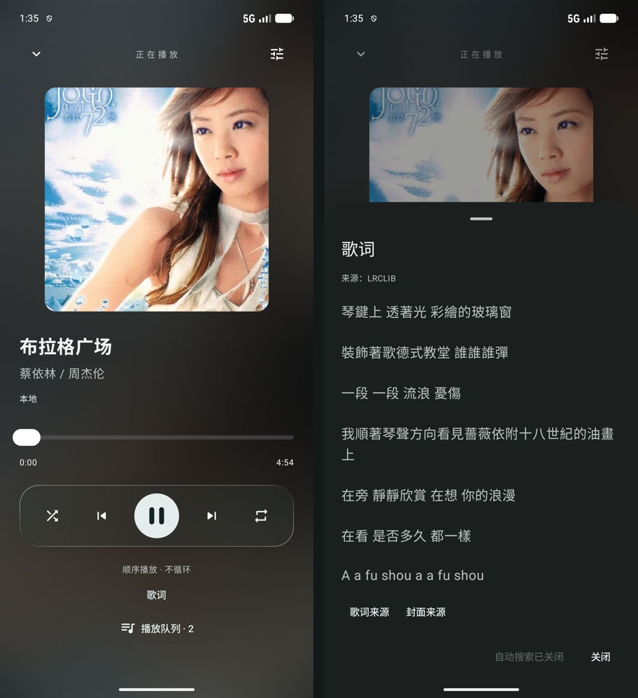
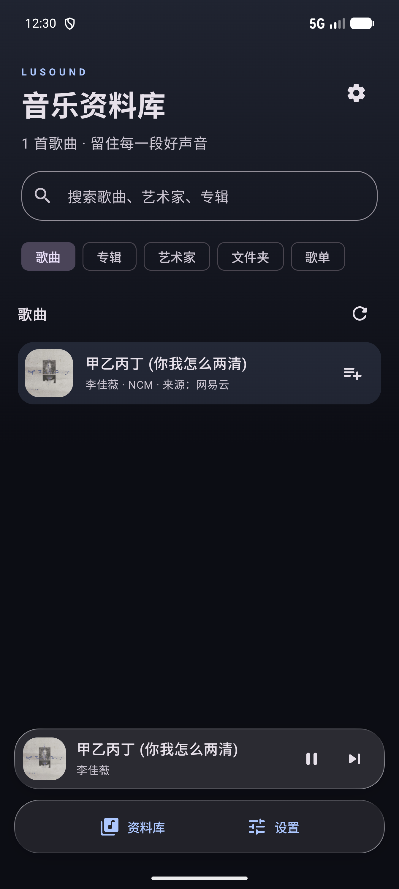
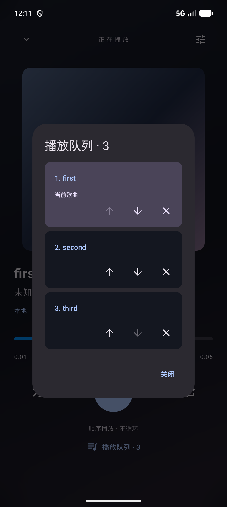
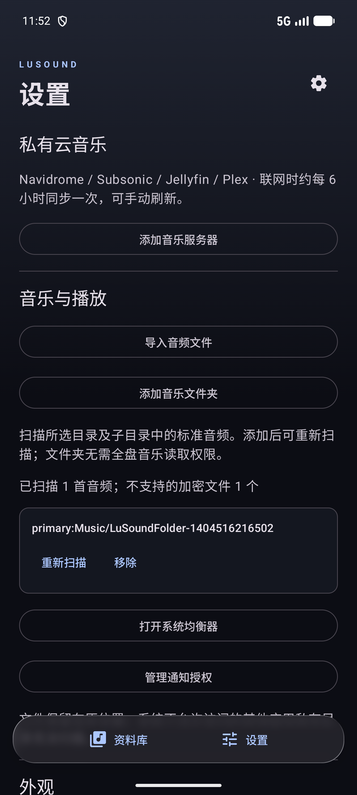
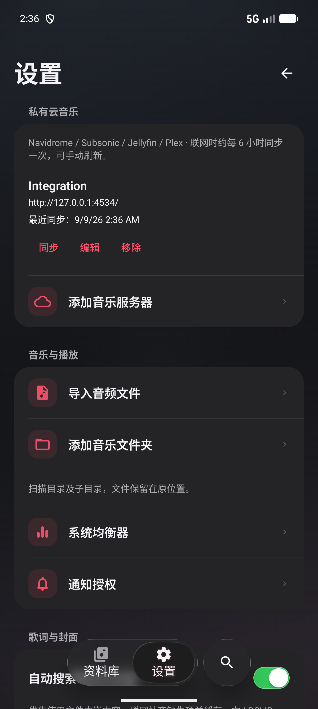
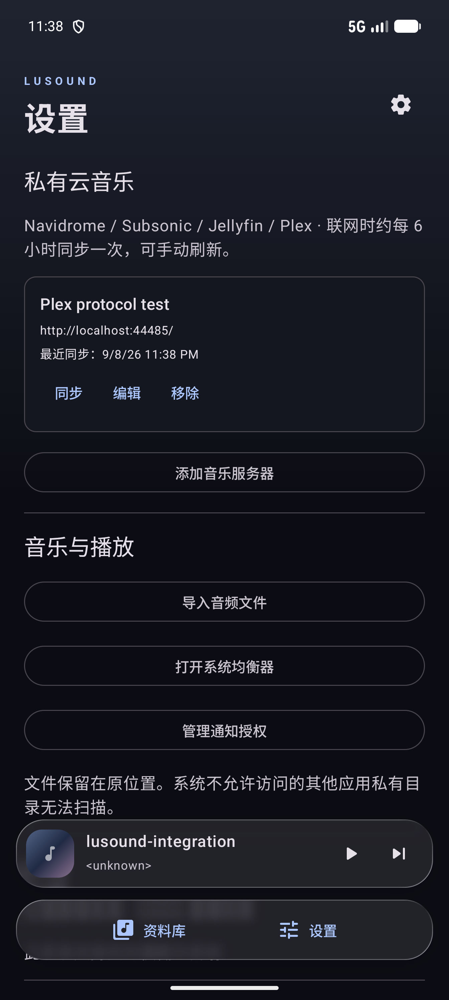

# 琉声 LuSound

Android 原生 Kotlin 本地与私有云音乐播放器。当前阶段为 0.9.0：联网自动补齐歌词与封面，沿用统一的资料库、播放器、设置及底部面板视觉；支持本地播放、Navidrome / Subsonic / Jellyfin，以及实验性 Plex 手动 Token 接入。

## 当前功能

- MediaStore 扫描标准音频、搜索、歌曲/专辑/艺术家/文件夹分类、创建歌单和添加/移除歌曲；暂时离线的存储卷保留歌单关系。
- NCM 文件与授权目录导入：读取歌曲信息和封面，以内存数据流交给 Media3 解码，支持播放与 seek；不输出明文音频。
- SAF 文件与目录授权导入，持久保留只读 URI 权限；不生成音频副本。目录递归扫描、保留子目录分类，支持手动重扫与移除。MediaStore 媒体库在前台观察系统媒体变化并刷新。
- Media3 后台播放、媒体通知、音频焦点、耳机断开暂停、进度跳转、随机和循环。队列支持点击切歌、上移/下移、移除、当前歌曲标记；重复歌曲作为独立条目保留。
- Navidrome / Subsonic Token + Salt 鉴权、完整音乐库和只读服务器歌单同步、在线流播放及封面、本地与在线音乐混合队列。联网时由 WorkManager 约每 6 小时同步，支持手动同步；失败保留上次成功的数据。
- Jellyfin 官方 Kotlin SDK 1.8.12：账号登录、加密访问令牌、音乐库与只读音频歌单同步、原文件流播放及封面；保留歌单中的重复歌曲。
- Plex 手动 Token 接入（实验性）：音乐库、只读音频歌单与封面同步、原文件播放；访问令牌加密存储，保留歌单重复项。尚未通过真实账号验收。
- 自动搜索缺失歌词与封面：读取内嵌封面和 FLAC 歌词，使用 LRCLIB、MusicBrainz / Cover Art Archive；歌词跟随播放并支持点击跳转，缓存可离线使用，设置中可关闭。
- 系统均衡器入口绑定实际音频会话；必须先播放，设备需提供系统音效控制面板。
- 从 Convx 迁移的 backdrop 渲染源码及 LiquidSlider 拖动动效，悬浮播放栏、共享封面氛围背景、深浅主题跟随系统；统一导航选中态、设置分组，以及队列/服务器配置底部面板。当前不是 Convx 全部页面的完整复刻。
- Android 8–11：半透明材质；Android 12：实时模糊；Android 13+：实时模糊和折射。低版本封面背景不具备系统实时模糊。


## 编译

最低 API 26，target API 34，compile API 37。Gradle Wrapper 9.5.0、AGP 9.3.0；使用 Android Studio 自带 JBR（Java 17+，本机使用 JBR 25）。Kotlin 业务代码输出 JVM 17 字节码。

1. 安装 Android Studio 和 SDK Platform 37、Build Tools 36.0.0；通过 SDK Manager 接受许可证。
2. 用 Android Studio 打开目录，配置本机 `local.properties` 中的 `sdk.dir`。此文件不应提交。
3. 设置 `JAVA_HOME` 指向 Android Studio 的 JBR，然后执行：

```sh
./gradlew :app:assembleDebug :app:lintDebug
```

仪器测试使用 API 33+ 设备，覆盖真实 MediaStore、Room 升级、本地音频与服务器流播放。云集成测试需要隔离的真实 Navidrome（验证版本 0.63.2），请从官方 Releases 下载对应平台二进制并校验 SHA-256。在单独终端运行：

```sh
python3 scripts/navidrome-fixture.py /absolute/path/to/navidrome
```

测试服务只绑定本机 4534 端口，自动生成 WAV 和歌单，使用专用测试账号，不连接用户音乐库。看到 Fixture ready 后，解锁测试设备并运行（替换设备序列号）：

```sh
adb -s emulator-5554 reverse tcp:4534 tcp:4534
ANDROID_SERIAL=emulator-5554 ./gradlew :app:connectedDebugAndroidTest
```

Jellyfin 测试另外需要一个全新的隔离服务，监听 `127.0.0.1:8097`。下载官方 Jellyfin 10.11.11 与 Jellyfin FFmpeg，在独立临时目录启动服务；为测试音乐目录准备 WAV 与 `folder.png` 封面。在该服务的 `config/network.xml` 中设置 `InternalHttpPort` / `PublicHttpPort` 为 8097，`LocalNetworkAddresses` 为 `127.0.0.1`，然后运行：

```sh
/path/to/jellyfin --datadir /tmp/jellyfin-test/data --configdir /tmp/jellyfin-test/config --cachedir /tmp/jellyfin-test/cache --logdir /tmp/jellyfin-test/log --nowebclient --ffmpeg /path/to/ffmpeg
# 另一终端：仅允许配置尚未完成启动向导的隔离服务
python3 scripts/configure-jellyfin-fixture.py /absolute/path/to/test-music
adb -s emulator-5554 reverse tcp:8097 tcp:8097
```

同时启动两个测试服务后执行完整仪器测试。Plex 的三项协议测试使用进程内 MockWebServer，无需 Plex 账号；覆盖分页、令牌请求头、同步失败保留数据及 Media3 对测试 WAV 的真实播放，但不替代真实 Plex Media Server 验收。单独运行可添加 `-Pandroid.testInstrumentationRunnerArguments.class=app.lusound.PlexProtocolTest,app.lusound.PlexPaginationTest`。仅运行本地测试时，可添加 `-Pandroid.testInstrumentationRunnerArguments.class=app.lusound.LibraryPlaybackTest,app.lusound.NavigationTest,app.lusound.DatabaseMigrationTest,app.lusound.DocumentTreeTest,app.lusound.QueueEditingTest`。

完成后在两个服务终端按 Ctrl-C。Navidrome 临时库自动删除；Jellyfin 测试目录由运行者清理。请使用专门的模拟器或测试设备；测试会写入测试歌单。

国内网络可用 `./gradlew -PuseAliyun=true :app:assembleDebug` 启用阿里云 Google/Maven Central 镜像。Gradle 分发包仍需网络可达；镜像不保证覆盖全部依赖。不要把镜像下载失败解释成编译成功。

## 自动歌词与封面

默认开启，可在“设置 → 自动搜索歌词与封面”关闭。扫描、导入、云库同步后创建带网络约束的后台任务；播放时也会读取本地标签。已有文件内嵌内容优先，服务器提供的封面保留。歌词面板提供来源链接和“重新匹配”（清除在线匹配结果，保留内嵌内容）。

使用现有公开服务和解析实现：

- [LRCLIB](https://github.com/tranxuanthang/lrclib)：歌词搜索与时间轴，标准 LRC 解析适配自 Convx。
- [MusicBrainz / Cover Art Archive](https://github.com/metabrainz/libcoverart)：按专辑和歌手查询封面；每次请求至少间隔 1.1 秒，携带应用 User-Agent。
- [Opencc4j](https://github.com/houbb/opencc4j)：本地简繁转换辅助匹配，兼容 Android 8；不会转换用户文件。

仅提交查询所需的歌曲元数据，不上传音频、路径或服务器凭据；歌词候选在本地按标题、歌手、时长（误差不超过 3 秒）筛选。封面与歌词单独缓存，不修改原文件。无结果也缓存 7 天，请求失败记录原因并等待至少 1 小时后的下一次任务；瞬时网络错误由 HTTP 客户端最多尝试 3 次，亦可手动重新匹配。关闭自动搜索会取消排队任务，保留已缓存内容。

目前内嵌歌词读取限于 FLAC，其他标准音频可联网匹配；本地 LRC 旁置文件尚未接入。公开服务的地区连通性和曲库覆盖无法保证，没有可信匹配时展示空状态，不套用其他歌手或不同时长版本。

真实文件验证使用《半岛铁盒》（内嵌封面与歌词）和《布拉格广场》（缺失项在线补齐），原始文件哈希保持不变。运行 `MetadataIntegrationTest` 前，将这两类具有完整标签的已授权 FLAC 样本放到隔离测试设备的 `/sdcard/Android/data/app.lusound.debug/files/standard-embedded.flac` 与 `standard-missing.flac`；测试会访问上述公开服务。样本、缓存和音频均不进入仓库或 APK。



## 签名

Release 不复用 debug 签名。通过以下环境变量提供密钥：

- `LUSOUND_KEYSTORE`：绝对路径
- `LUSOUND_STORE_PASSWORD`
- `LUSOUND_KEY_ALIAS`
- `LUSOUND_KEY_PASSWORD`

```sh
./gradlew :app:assembleRelease
```

本地 `keystore/` 保存本次测试发布密钥和 `signing.env`，均已排除版本控制；测试 release 身份不是商店正式发布身份。请自行妥善保管，丢失密钥无法签署可覆盖安装的更新。不要公开此目录。

标准输出路径：`app/build/outputs/apk/debug/app-debug.apk`、`app/build/outputs/apk/release/app-release.apk`。

## 加密格式与服务器支持

| 功能 | 当前状态 |
| --- | --- |
| MP3 / FLAC / WAV / M4A 等标准音频 | 使用 Media3 与设备支持的编解码器 |
| NCM | 已接入标准 music 元数据容器，支持 MP3/FLAC 音频载荷；用户提供的真实样本已验证 |
| QMC0 / QMC3 / QMCFLAC / QMCv2 | 未接入 |
| KGM / KGMA | 未接入 |
| Navidrome / Subsonic | 已接入，Token + Salt 鉴权；Navidrome 0.63.2 实测 |
| Jellyfin | 已接入官方 SDK，真实服务 10.11.11 验证；原文件流播放 |
| Plex | 实验性手动 Token 接入；协议测试通过，真实账号尚未验证 |
| Koel 原生 API | 尚未接入 |

NCM 使用公开的固定格式密钥解析容器，不访问账号或登录缓存。标准 music 元数据、AES 填充、音频类型和数据区边界必须有效；损坏文件或未知变体会明确报错，不保证所有扩展名为 NCM 的文件都兼容。解密后的压缩音频按请求偏移在内存中交给 Media3 解码；不生成 MP3/FLAC/PCM 文件，不使用音频磁盘缓存。封面图片可单独缓存。QMC/KGM 等格式仍未接入。

当前不假设 Koel 原生 API 兼容 Subsonic；其他服务后续逐一接入。网络请求统一携带 LuSound User-Agent，Subsonic 密码、Jellyfin 与 Plex 访问令牌经 Android Keystore AES-GCM 加密存储，播放条目只保存歌曲 ID，鉴权在请求时生成。

普通权限无法突破其他应用的私有存储限制；不提供 Root/Shizuku 功能。仅处理用户有权访问和播放的媒体；不提取其他应用账号凭据；NCM 固定格式密钥已按用户确认内置。是否写出副本并不能单独决定使用是否合法。

## 许可证与来源

项目按 GPL-3.0 分发，参见 `LICENSE`。移植基线与来源见 `NOTICE`。`com.convx.music.ui.component.backdrop` 保留上游结构、版权头及必要 API 兼容修改；其包含的 Kyant0 源码遵循 Apache-2.0（`licenses/Apache-2.0.txt`）。LuSound 新业务代码位于 `app.lusound`，未引入 Convx 的 YouTube/歌词/社交网络模块。

## NCM 播放与验证

设置 → 导入音频文件，选择 `.ncm`；也可添加其所在目录。无需先转成 MP3 或 FLAC。数据库保存原始文档 URI，播放时打开原文件并按需解密；需要文件提供程序支持可定位读取。授权失效后重新选择同一文件或目录。

完整测试需要额外提供一份有权使用的真实 NCM 样本（至少 70 KB、时长超过 3 秒并含封面），样本不随源码或 APK 分发。在安装 debug APK 后执行：

```sh
adb -s emulator-5554 shell mkdir -p /sdcard/Android/data/app.lusound.debug/files
adb -s emulator-5554 push '/absolute/path/to/sample.ncm' /sdcard/Android/data/app.lusound.debug/files/ncm-sample.ncm
```

NcmContainerTest / NcmPlaybackTest 覆盖损坏数据、超大长度拒绝、非对齐偏移读取、目录导入、封面、实际解码与 seek，并校验加密样本内容未变。测试只复制加密文件，不复制解密后的音频。尚未验证所有 NCM 变体；QMC/KGM 不在此次支持范围。

VisualFlowTest 使用同一份外部 NCM 样本，记录资料库、播放器、队列、设置、服务器表单及键盘状态；不会把样本打包进 APK。视觉检查同时覆盖深色常规尺寸与浅色 360dp / 1.3 倍字体，输入时保持当前字段和提交操作可见。



## 播放队列

展开播放器 → 播放队列。点击歌曲切歌；箭头调整顺序，关闭图标只移除队列条目，不删除文件或歌单。移动当前歌曲保留播放进度；移除当前歌曲由 Media3 按播放顺序选择后续项，移除最后一项后显示空队列。随机播放开启时，队列显示编辑顺序，实际下一首由随机播放决定。

以下截图来自真实 Media3 播放生成的测试音频：



## 音乐文件夹

设置 → 添加音乐文件夹 → 在系统选择器中选择目录并授权。扫描包括子目录中的标准音频，结果按原子目录出现在资料库“文件夹”分类；音乐文件始终留在原位置。目录授权在重启后保留，不需要全盘音乐读取权限。

- 新增、移动或删除文件后，在设置中的目录卡片点击“重新扫描”；目录不参与云服务器的定时同步。
- 完整扫描成功后才替换该目录的映射；权限失效、目录仍在加载、音频损坏或读取失败时显示错误并保留旧数据。重新授权时选择同一目录。
- 有效 NCM 与标准音频一起导入，并标注“来源：网易云”。QMC/KGM 等未支持文件计入扫描结果的不支持数量；其他非音频文件忽略。
- 移除目录需确认，会释放目录只读授权并移除该来源的歌曲、歌单条目和当前队列项，原文件不会删除。
- Android 系统不允许选择的目录无法访问。多个重叠授权目录或同一文件通过 MediaStore 和 SAF 导入时可能出现多条来源记录，当前不做跨来源文件去重。



## 服务器配置

设置 → 添加音乐服务器 → 选择协议，输入连接信息，然后点击“连接并同步”。Subsonic 和 Jellyfin 使用用户名及密码；Plex 使用 Token。

- 公网示例：`https://music.example.com/`；部署在子路径时填完整根路径，如 `https://example.com/navidrome/`。
- 局域网示例：`http://192.168.1.20:4533/`。手机需能访问该地址；HTTP 仅适用于受信任的局域网。
- 地址不要填写 `/rest`、登录页或歌曲链接。出于凭据保护，不自动跟随重定向，请填写最终地址。
- 首次成功同步后，歌曲显示在资料库，服务器歌单显示在“歌单”并标注只读。可把在线歌曲添加到本地歌单或播放队列。
- “编辑”支持名称和密码 / Token 更新；变更地址或账号请新增连接。移除连接会清除该来源的本地映射，不修改远端库。
- 目前缓存元数据，不提供离线音频下载。后台同步时间由系统调度，强行停止应用后需重新打开。

Jellyfin 填写服务根地址（例如 `http://192.168.1.20:8096/`），不要附加 `/web`。登录后保存访问令牌；服务器撤销会话后在“编辑”中重新输入密码。Jellyfin 播放使用原始音频，格式须由设备 / Media3 支持。


下图为模拟器连接本机隔离 Navidrome 的真实界面；`127.0.0.1:4534` 通过 adb reverse 映射，仅用于测试：




Plex 选择“Plex”，填写名称、服务器根地址（例如 `http://192.168.1.20:32400/`）和有权访问该服务器的 X-Plex-Token，无需用户名。令牌获取方式见 [Plex 官方指南](https://support.plex.tv/articles/204059436-finding-an-authentication-token-x-plex-token/)。不要把 Token 放在地址中；应用仅通过请求头发送，令牌失效后需在“编辑”中重新填写。当前支持原文件播放，不包含 PIN / 扫码登录、转码或 Plexamp 遥控。

以下 Plex 截图来自模拟器连接协议测试服务，不代表真实 Plex 账号验收；其中随机端口仅用于测试。




## 验证状态

0.9.0 已完成 Debug 与测试签名 Release 构建，lint 为 0 错误、33 条警告（主要为依赖更新与清单建议）。API37 模拟器上的六项真实集成测试覆盖数据库 1→4 / 2→4 升级与原有 Subsonic 凭据保留、本地播放和导航、添加服务器、同步与鉴权失败保留数据、封面读取、在线播放与 seek、在线到本地的混合队列切换。另有三项 Plex 协议测试通过，覆盖请求头鉴权、分页与重复条目、失败保留数据、封面及测试音频的实际解码、seek 和混合队列切换；新增目录集成测试覆盖真实系统文件提供程序、持久只读授权、递归扫描、重扫保留歌单、损坏文件保留数据、目录音频解码和管理界面，队列测试覆盖移动当前项保留进度、播放中移除、空队列与重复歌曲。NCM 测试覆盖真实样本导入和播放、随机读取、元数据与封面、损坏文件拒绝及原始样本不变。完整 16 项仪器测试全部通过，新增两项真实 FLAC 元数据与在线匹配验证，包含资料库→播放器→队列→设置→服务器表单的实际视觉流程。测试签名 Release 已通过签名校验、覆盖安装到模拟器并成功冷启动。Plex 尚无可用测试账号，真实服务器鉴权、音乐库与播放验收仍待完成。

可安装包和 SHA-256 校验文件位于 `dist/`，该目录不参与版本控制。尚未覆盖所有 Android 版本、厂商后台限制或其他 Subsonic 实现。Jellyfin 目前不提供转码或远端设备投播。
