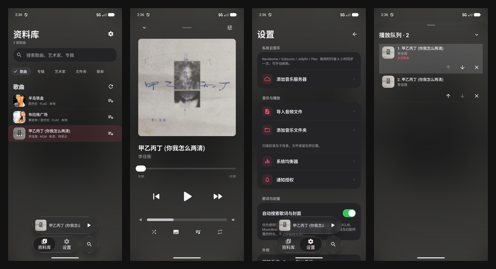
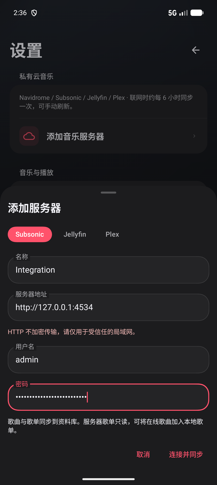
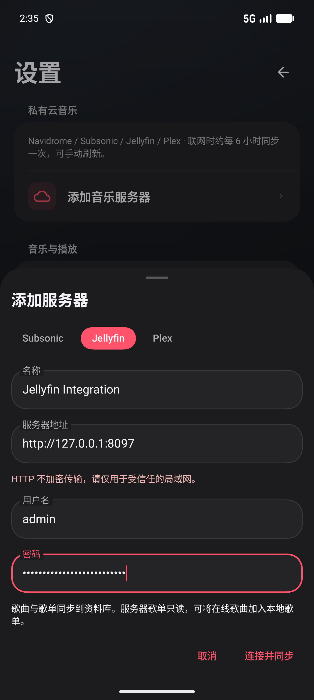
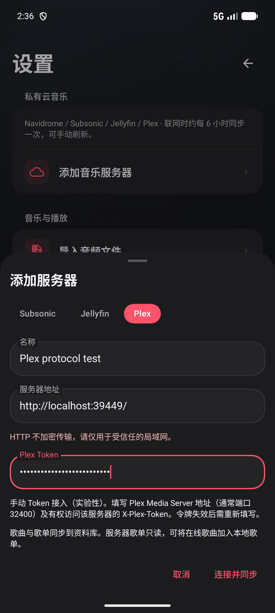

# 琉声 LuSound

面向 Android 的本地与私有云音乐播放器。将设备上的音乐与自建服务器音乐库汇集到同一资料库，以液态玻璃界面呈现专辑、歌词和播放队列。

[下载安装包](https://github.com/ion-lgb/lusound/releases) · [报告问题](https://github.com/ion-lgb/lusound/issues) · [GPL-3.0 许可证](LICENSE)



## 功能

- **统一音乐库**：扫描本地音频，按歌曲、专辑、艺术家、文件夹和歌单浏览；支持搜索、文件导入与目录授权。
- **私有云播放**：接入 Navidrome / Subsonic、Jellyfin，以及实验性的 Plex；同步音乐库与服务器歌单，支持本地和在线歌曲混合播放。
- **完整播放控制**：后台播放、媒体通知、音频焦点、耳机断开暂停、随机与循环；队列支持切歌、排序和移除，保留重复条目。
- **歌词与封面**：优先读取内嵌内容，联网匹配缺失信息并缓存；支持同步歌词、点击歌词跳转和手动重新匹配。
- **NCM 流式读取**：导入可访问的 NCM 文件，在内存中按需解密并交给 Media3 解码，支持进度跳转，不生成明文音频文件。
- **玻璃界面与动效**：移植并适配 Convx 默认界面，包括悬浮导航、共享封面转场、播放器手势展开、封面轮播、歌词强调、弹簧队列面板及列表回弹。

深浅主题跟随系统。Android 8–11 使用半透明材质，Android 12 支持实时模糊，Android 13 及以上支持实时模糊与折射。系统均衡器入口需要设备提供音效控制面板，并在播放后使用。

## 安装

支持 **Android 8.0（API 26）及以上**。从 [GitHub Releases](https://github.com/ion-lgb/lusound/releases) 下载：

| 文件 | 用途 |
| --- | --- |
| `lusound-<版本>-release.apk` | 签名发布包，供日常安装体验 |
| `lusound-<版本>-debug.apk` | 调试包，使用独立应用 ID，可与发布包共存 |
| `SHA256SUMS-<版本>.txt` | 安装包 SHA-256 校验值 |

项目处于持续开发阶段。Release 使用项目测试发布签名；同签名、同应用 ID 的更新可覆盖安装。首次安装需允许安装来自该下载来源的应用。

## 使用

### 本地音乐

授予音乐读取权限后扫描设备媒体库，也可在“设置”中使用“导入音频文件”或“添加音乐文件夹”。目录授权支持递归读取标准音频与有效 NCM 文件，重启后保留；新增或移动文件后可手动重新扫描。

音乐始终保留在原位置。移除目录会移除该来源的本地记录及相关队列条目，不删除原文件。Android 限制访问的私有目录无法通过普通权限读取；同一文件经不同来源导入时暂不自动去重。

### 私有云服务器

进入“设置 → 添加音乐服务器”，选择协议，填写连接信息并点击“连接并同步”。

| 服务 | 地址示例 | 鉴权方式 | 支持范围 |
| --- | --- | --- | --- |
| Navidrome / Subsonic | `https://music.example.com/` | 用户名、密码；Token + Salt 鉴权 | 音乐库、只读歌单、封面与流播放 |
| Jellyfin | `http://192.168.1.20:8096/` | 用户名、密码；登录后保存访问令牌 | 音乐库、只读音频歌单与原文件播放 |
| Plex（实验性） | `http://192.168.1.20:32400/` | 手动填写 X-Plex-Token | 音乐库、只读音频歌单与原文件播放 |

支持服务部署在子路径下，例如 `https://example.com/navidrome/`。请填写最终服务根地址，不附加 `/rest`、`/web`、登录页或歌曲路径；应用不自动跟随重定向。HTTP 连接仅建议用于受信任的局域网。

首次同步后，在线歌曲可加入本地歌单和播放队列。联网时后台约每 6 小时同步，也可手动同步；失败时保留上次成功的数据。后台执行时间由 Android 调度。移除连接只清除本地映射，不修改服务器内容。

Plex 令牌获取方式见 [Plex 官方说明](https://support.plex.tv/articles/204059436-finding-an-authentication-token-x-plex-token/)。请将令牌填入专用字段，不放入地址。Jellyfin 会话或 Plex 令牌失效后，可在连接的“编辑”入口更新凭据。

<details>
<summary>查看服务器配置截图</summary>

| Navidrome / Subsonic | Jellyfin | Plex |
| --- | --- | --- |
|  |  |  |

截图来自隔离测试环境；Plex 使用协议测试服务，尚未完成真实 Plex 账号验证。截图中的本机地址与端口不应直接用于个人服务器配置。

</details>

### 自动歌词与封面

在“设置 → 自动搜索歌词与封面”中管理联网匹配。应用优先使用文件内嵌内容和服务器封面，通过 [LRCLIB](https://github.com/tranxuanthang/lrclib) 搜索歌词，通过 MusicBrainz / Cover Art Archive 查找封面。歌词面板提供来源链接及重新匹配入口。

查询仅发送歌曲标题、歌手、专辑和时长，不上传音频、文件路径或服务器凭据。匹配结果单独缓存，不修改原文件；关闭自动搜索会取消排队任务，并保留缓存。服务连通性和曲库覆盖会影响匹配结果。

## 格式与兼容性

| 格式或能力 | 状态 |
| --- | --- |
| MP3 / FLAC / WAV / M4A 等 | 使用 Media3 与设备支持的编解码器 |
| NCM | 支持标准 music 元数据容器中的 MP3 / FLAC 载荷；未知变体不保证兼容 |
| QMC0 / QMC3 / QMCFLAC / QMCv2、KGM / KGMA | 暂不支持 |
| FLAC 内嵌歌词、在线逐行同步歌词 | 支持 |
| 本地旁置 LRC、其他格式内嵌歌词 | 暂不支持 |
| Navidrome / Jellyfin | 已通过真实服务集成验证 |
| Plex | 实验性手动 Token 接入，通过协议测试，尚未通过真实服务器验证 |
| Koel 原生 API | 暂不支持，不假设其兼容 Subsonic |
| 离线音频下载、服务器转码、远端投播 | 暂不支持 |
| Plex PIN / 扫码登录、Plexamp 遥控 | 暂不支持 |

Convx 移植范围为默认界面及对应交互，不包括 Canvas、V2、DIY 替代播放器，也不包含其 YouTube、社交或 AI 服务。歌词动画使用实际逐行时间戳，不生成逐字时间轴。

## 隐私与媒体使用

服务器密码及访问令牌使用 Android Keystore 和 AES-GCM 加密存储。网络请求携带 LuSound User-Agent；在线音频直接流式播放，不建立音频磁盘缓存。

NCM 读取器使用公开的固定格式常量，不读取其他应用账号或登录缓存，不提供 Root / Shizuku 或私有目录访问绕过。解密后的压缩音频仅在内存中按需提供给播放器，封面可独立缓存。请仅使用有权访问和播放的媒体；不生成明文副本不代表任何使用场景均获得授权。本项目与所提及的音乐平台无隶属关系。

## 构建

项目采用 Kotlin、Jetpack Compose、Media3、Room、Retrofit / OkHttp、Coil 和 WorkManager。

| 配置 | 版本 |
| --- | --- |
| 最低 / 目标 / 编译 SDK | 26 / 34 / 37 |
| Gradle Wrapper / Android Gradle Plugin | 9.5.0 / 9.3.0 |
| JVM 字节码目标 | 17 |

1. 安装 Android Studio、SDK Platform 37 和 Build Tools 36.0.0，并接受 SDK 许可证。
2. 打开项目，在本地 `local.properties` 中配置 `sdk.dir`。
3. 将 `JAVA_HOME` 指向 Android Studio 随附的 JBR；已验证的构建环境使用 JBR 25。

```sh
./gradlew :app:assembleDebug :app:lintDebug
```

国内网络环境可通过可选参数启用阿里云 Maven 镜像：

```sh
./gradlew -PuseAliyun=true :app:assembleDebug
```

Gradle 分发包与镜像未覆盖的依赖仍需网络可达。

### Release 签名

通过环境变量提供自己的签名配置：

- `LUSOUND_KEYSTORE`：密钥库绝对路径。
- `LUSOUND_STORE_PASSWORD`：密钥库密码。
- `LUSOUND_KEY_ALIAS`：密钥别名。
- `LUSOUND_KEY_PASSWORD`：密钥密码。

```sh
./gradlew :app:assembleRelease
```

输出位于 `app/build/outputs/apk/debug/app-debug.apk` 和 `app/build/outputs/apk/release/app-release.apk`。请妥善保管签名密钥；密钥库、密码和本地 SDK 配置不应提交到版本控制。

## 测试与反馈

v0.10.0 已完成 Debug / Release 构建与签名检查，API 37 模拟器 19 项仪器测试通过，覆盖本地导入、数据库升级、NCM、混合队列、元数据匹配和界面交互。真实服务验证使用 Navidrome 0.63.2、Jellyfin 10.11.11；Plex 使用协议测试服务。Lint 为 0 错误、36 条警告。

界面验证包含 360dp 小屏、1.3 倍字体、浅色模式、软键盘和系统动画关闭场景。Release 已在 PMA110 实机覆盖安装并冷启动；Android 8 尚未完成运行时验证。测试环境及样本要求见 [集成测试说明](docs/testing.md)。

欢迎通过 [Issues](https://github.com/ion-lgb/lusound/issues) 报告问题，请附应用版本、Android 版本、设备型号和复现步骤。涉及服务器或日志时，请先移除密码、令牌与个人信息。

## 许可证与致谢

LuSound 按 [GPL-3.0](LICENSE) 分发。UI Design Inspired by [Convx](https://github.com/cosmictaserdev-creator/Convx)，默认界面及动效基于其 GPL-3.0 源码移植，固定基线为 `1e2237d9f8dd56de1c8a97dffc9c31e6596c437a`。

感谢 Convx、Kyant0 的 backdrop / Capsule、Elyes Mansour 的 compose-floating-tab-bar、Jellyfin SDK、LRCLIB、MusicBrainz / Cover Art Archive 及 Opencc4j。上游版权声明、具体来源及第三方许可证见 [NOTICE](NOTICE) 和 [licenses](licenses)。
